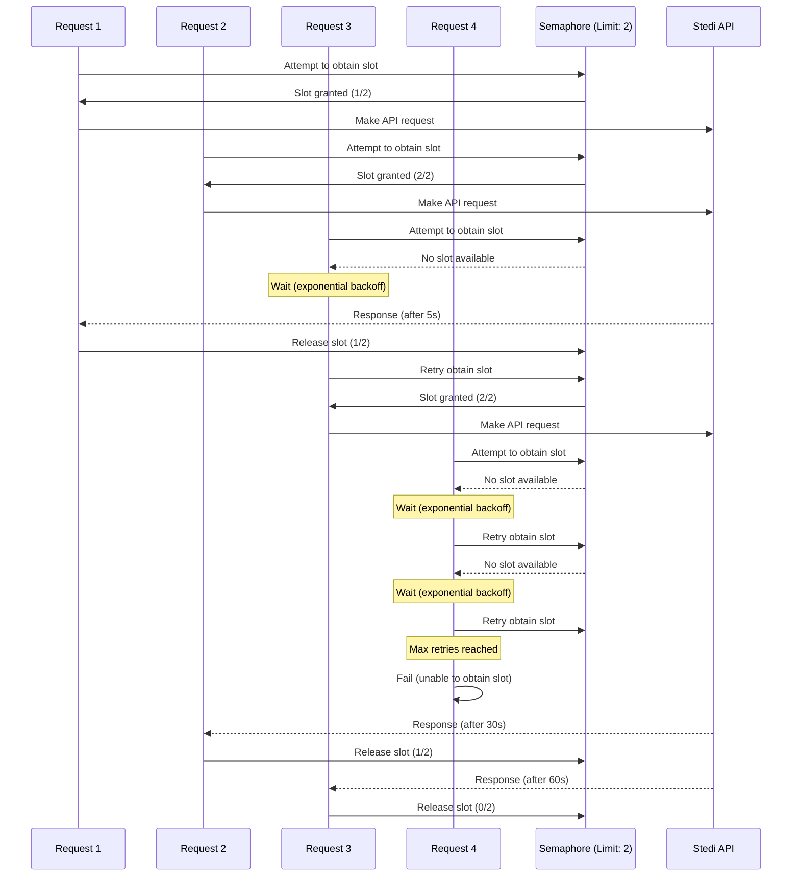

# Stedi Eligibility Check API Concurrency Management

This repository contains examples demonstrating how to effectively manage concurrency when interacting with Stedi resources, with a particular focus on the Stedi Eligibility Check APIs.

## Overview

Managing concurrency in API interactions, especially with the Stedi Eligibility Check APIs, presents unique challenges that go beyond simple requests per second (RPS) considerations. The complexity arises from the highly variable response times of these APIs, which can range from mere seconds to up to 90 seconds per request.

This variability in response times means that traditional RPS-based concurrency management strategies may not be sufficient. Instead, more sophisticated approaches are needed to ensure efficient use of resources while avoiding overload or rate limiting issues.

## Key Concepts

- **Variable Response Times**: Requests to the Stedi Eligibility Check APIs can take anywhere from a few seconds to 90 seconds to complete.
- **Concurrency vs. RPS**: Due to the wide range of possible response times, concurrency management in this context is not simply about limiting requests per second.
- **Adaptive Strategies**: The examples in this repository demonstrate adaptive concurrency management techniques that account for the unpredictable nature of response times.

## Concurrency Management Strategy

In these examples, we use DynamoDB to implement a semaphore-based concurrency control mechanism. Here's how it works:

1. We attempt to obtain a count on a semaphore up to a configurable limit.
2. If we can't obtain the semaphore, we wait using an exponential backoff strategy with jitter.
3. We continue attempting to obtain the semaphore, but bail after a given amount of time.
4. Once we obtain the semaphore, we perform our API request.
5. After the request is complete (or fails), we release the semaphore.

This approach allows us to manage the concurrency of requests effectively, ensuring we don't overwhelm the Stedi APIs while still maintaining efficient throughput.

### Concurrency Flow Diagram

The following Mermaid diagram illustrates the process of obtaining and releasing semaphores to manage concurrency (up to 3 concurrent requests):

