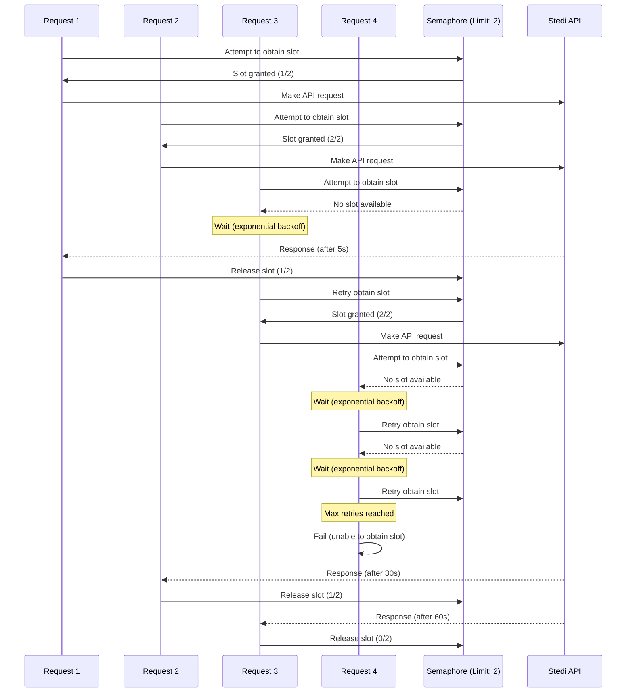

# Stedi Eligibility Check API Concurrency Management

This repository contains a reference implemenation demonstrating how to effectively manage concurrency when interacting with Stedi resources, with a particular focus on the Stedi [Eligibility API](https://www.stedi.com/docs/api-reference/healthcare/post-healthcare-eligibility).

## Overview

Managing concurrency in API interactions, especially with the Stedi [Eligibility API](https://www.stedi.com/docs/api-reference/healthcare/post-healthcare-eligibility), presents unique challenges that go beyond simple requests per second (RPS) considerations. The complexity arises from the highly variable response times of these APIs, which can range from milliseconds up to 90 seconds per request due to the speed of processing by various payers at different times.

This variability in response times means that traditional RPS-based concurrency management strategies may not be sufficient. Instead, more sophisticated approaches are needed to ensure efficient use of resources while avoiding overload or rate limiting issues.

### Illustration of the Problem

Consider the following scenario:

Your Stedi account has an allocation of 5 concurrent requests. You implement a naive concurrency strategy based on an estimated average response time of 1 second per request by setting your application to make 5 requests per second. However, due to the variability in payer response times, if one of the requests takes 5 seconds to complete, your application will continue to send additional requests, exceeding the concurrency limit and causing rate limiting issues.

## Concurrency Management Strategy

In this reference implementation, we've use DynamoDB to implement a semaphore-based concurrency control mechanism. Here's how it works:

1. We attempt to obtain a count on a semaphore up to a configurable limit.
2. If we can't obtain the semaphore, we wait using an exponential backoff strategy with jitter.
3. We continue attempting to obtain the semaphore, but bail after a given amount of time.
4. Once we obtain the semaphore, we perform our API request.
5. After the request is complete (or fails), we release the semaphore.

This approach allows us to manage the concurrency of requests effectively, ensuring we don't overwhelm the Stedi APIs while still maintaining efficient throughput.

## DynamoDB Table Structure

The DynamoDB table used for the semaphore implementation requires the following structure:

- Table Name: As specified in your configuration
- Primary Key:
  - Partition Key (pk): String
  - Sort Key (sk): String
- Additional Attributes:
  - count: Number (used for the semaphore count)
  - expiresAt: Number (used for lock expiration)

Example items in the table:

1. Semaphore count item:

   ```
   { pk: "<semaphoreName>", sk: "COUNT", count: <number> }
   ```

2. Lock items:
   ```
   { pk: "<semaphoreName>", sk: "LOCK#<lockId>", expiresAt: <timestamp> }
   ```

Make sure to provision adequate read and write capacity for your table to handle the expected throughput of your application.

## Handling Cancelled Requests

It's important to note that cancelling a request on your side does not automatically cancel the request or release the lease on Stedi's side. This can lead to potential issues with resource management and concurrency control. Because of this, we don't recommend cancelling requests, just let them run to natural completion and response from Stedi. Stedi's Eligibility API times out after 90 seconds, so if you don't receive a response within that time, you can consider the request failed and release the semaphore.

## Lease System for Deadlock Prevention

To prevent deadlocks caused by processes that may have died without releasing their semaphore hold, it's crucial to implement a lease system. This system works as follows:

1. When a process obtains a semaphore, it's granted a lease with an expiration time.
2. The process must periodically renew its lease while it's still using the semaphore.
3. If a process fails to renew its lease before it expires, the system assumes the process has died.
4. A background process or the next process attempting to acquire a semaphore can then clean up these expired leases, releasing the semaphore slots back to the pool.

This lease system ensures that even if processes crash or network issues occur, the semaphore slots will eventually be freed, preventing indefinite deadlocks.

## Important Notes

The DynamoDB-based semaphore implementation provided in these examples works well for managing concurrency at lower to moderate scale of ~20-30 concurrency. It's a good starting point for many applications. (Depending on your average response times if they are longer, this can push higher to 50 or more concurrency.) However, have extreme amounts of clients hammering on the semaphore will always be contentious and may hurt your throughput.

For applications requiring tremendous scale or very high levels of concurrency, a more robust solution like Redis might be more appropriate. For more information on implementing high-scale semaphores with Redis, refer to the Redis documentation on [Fair Semaphores](https://redis.io/ebook/part-2-core-concepts/chapter-6-application-components-in-redis/6-3-counting-semaphores/6-3-2-fair-semaphores/).

## Example Class Usage

### Batch Eligibility and Realtime Eligibility Semaphore Configurations

Let's say you are alloted 15 concurrency within Stedi's eligibility check API. You can configure your semaphores like so, so that you'll always have at least 5 slots available for realtime checks. We may also want to tweak the retry logic to be more aggressive or less aggressive depending on our specific use case.

```typescript
const batchSemaphore = new DynamoDBSemaphore(client, {
  tableName: "MySemaphoreTable",
  semaphoreName: "BatchConcurrency",
  maxLocks: 10,
  lockTtlSeconds: 90, // the current timeout of Stedi's Eligibility API
  retryConfig: {
    maxRetries: 30,
    baseDelay: 500, // milliseconds
    maxDelay: 10_000, // milliseconds
  },
  debug: false, // set to true to see debug logs
});

const realtimeSemaphore = new DynamoDBSemaphore(client, {
  tableName: "MySemaphoreTable",
  semaphoreName: "RealtimeConcurrency",
  maxLocks: 5,
  lockTtlSeconds: 90, // the current timeout of Stedi's Eligibility API
  retryConfig: {
    maxRetries: 10,
    baseDelay: 100, // milliseconds
    maxDelay: 1_000, // milliseconds
  },
  debug: false, // set to true to see debug logs
});

// usage
const lockId = await batchSemaphore.acquireLock(); // this can fail, so consider retrying or looping until you obtain the lock

// do some work
await Promise.resolve(() => setTimeout(2000));

await semaphore.releaseLock(lockId); // will try its best to release the lock
```

See tests in the source code for more examples.

### Concurrency Flow Diagram

The following Mermaid diagram illustrates the process of obtaining and releasing semaphores to manage concurrency (up to 3 concurrent requests):


